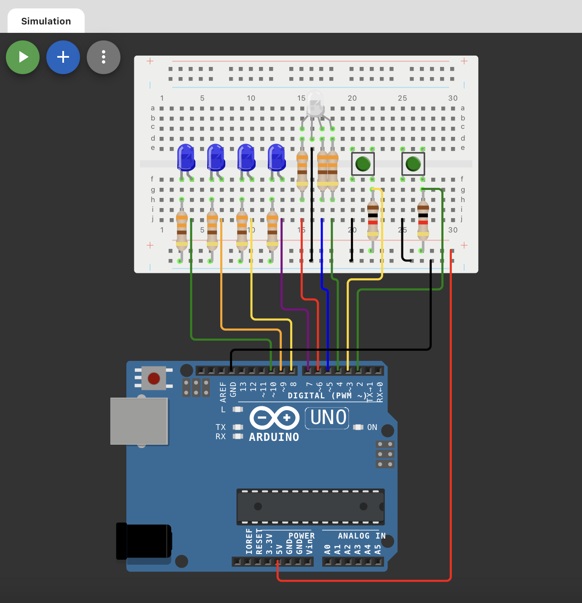

# Sistem de Încărcare a unui Vehicul Electric

## 1. Descriere
Acest proiect simulează o stație de încărcare pentru vehicule electrice, folosind LED-uri, butoane și alte componente, incluzând debouncing-ul butoanelor. Proiectul este construit folosind un microcontroller **ATMega328P** și API-ul **Arduino**.

### Funcționalități

- **Stare stație**: Stația de încărcare începe în starea "liberă", indicată de LED-ul RGB verde. La apăsarea butonului de start, stația trece în starea "ocupată", iar LED-ul RGB devine roșu.
- **Încărcare progresivă**: Încărcarea este simulată prin aprinderea succesivă a celor 4 LED-uri, fiecare reprezentând un nivel de încărcare (L1 = 25%, L2 = 50%, L3 = 75%, L4 = 100%). LED-urile se aprind la un interval de 3 secunde.
- **Control prin butoane**: Apăsarea scurtă a butonului de start inițiază procesul de încărcare, iar apăsarea lungă (minim 1s) a butonului de stop întrerupe încărcarea și resetează stația la starea "liberă".

### Proiectul în funcțiune

### Video YouTube

    <iframe width="560" height="315" src="https://www.youtube.com/embed/_CvzafnYRRA?si=KmNKfYqXdJFHV0K4" title="YouTube video player" frameborder="0" allow="accelerometer; autoplay; clipboard-write; encrypted-media; gyroscope; picture-in-picture; web-share" referrerpolicy="strict-origin-when-cross-origin" allowfullscreen></iframe>

## 2. Componente utilizate
- **4x LED-uri**: Simulează procentul de încărcare
- **1x LED RGB**: Indică starea stației (liber - verde, ocupat - roșu).
- **2x Butoane**: Start/Stop încărcare.
- **8x Rezistoare**: 6x 330 ohm pentru LED-uri și 2x 1K ohm pentru butoane.
- **Opțional**: Un al 7-lea rezistor de 330 ohm pentru canalul albastru al LED-ului RGB. Acest canal nu va fi utilizat în proiect, dar poate fi conectat pentru extinderea funcționalității pe viitor.
- **Breadboard**: Pentru conectarea circuitelor.
- **Linii de legătură**: Pentru conexiunile pe breadboard.

### Componente utilizate

## 3. Schema electrică
### Diagrama realizată în TinkerCAD

